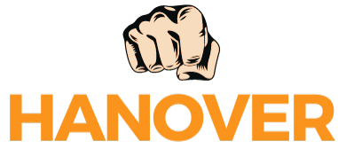

<a name="readme-top"></a>

[![Contributors][contributors-shield]][contributors-url]
[![Forks][forks-shield]][forks-url]
[![Stargazers][stars-shield]][stars-url]
[![Issues][issues-shield]][issues-url]
[![MIT License][license-shield]][license-url]
[![LinkedIn][linkedin-shield]][linkedin-url]


<!-- PROJECT LOGO -->
<br />
<div align="center">
  <a href="https://github.com/othneildrew/Best-README-Template">
    
  </a>

  <h3 align="center">Hanover Fitness</h3>

  <p align="center">
    An Investment in Health is the best investment you can do!
    <br />
    <a href="https://github.com/sai-prasad-1/Project_Exercise-App"><strong>Explore the docs »</strong></a>
    <br />
    <br />
    <a href="https://hanoverfitness.netlify.app">View Demo</a>
    ·
    <a href="https://github.com/sai-prasad-1/Project_Exercise-App/issues">Report Bug</a>
    ·
    <a href="https://github.com/sai-prasad-1/Project_Exercise-App/issues">Request Feature</a>
  </p>
</div>


<!-- TABLE OF CONTENTS -->
<details>
  <summary>Table of Contents</summary>
  <ol>
    <li>
      <a href="#about-the-project">About The Project</a>
      <ul>
        <li><a href="#built-with">Built With</a></li>
      </ul>
    </li>
    <li>
      <a href="#getting-started">Getting Started</a>
      <ul>
        <li><a href="#prerequisites">Prerequisites</a></li>
        <li><a href="#installation">Installation</a></li>
      </ul>
    </li>
    <li><a href="#roadmap">Roadmap</a></li>
    <li><a href="#contributing">Contributing</a></li>
    <li><a href="#license">License</a></li>
    <li><a href="#contact">Contact</a></li>
    
  </ol>
</details>


<!-- ABOUT THE PROJECT -->
## About The Project

[![Product Name Screen Shot][product-screenshot]](https://hanoverfitness.netlify.app)

There are many great websites for workout available  however, I didn't find one that really suited my needs so I created this enhanced one. I want to create a webapp so amazing that it'll be the last one you ever need -- I think this is it.

Here's why:
* Your time should be focused on creating something amazing. A project that solves a problem and helps others
* You should implement DRY principles to the rest of your life :smile:

Of course,this will not serve all your needs  since your needs may be different. So I'll be adding more features  in the near future. You may also suggest changes by forking this repo and creating a pull request or opening an issue.


<p align="right"><a href="#readme-top">back to top</a></p>


### Built With


* [![React][React.js]][React-url]
* 
* 


<p align="right">(<a href="#readme-top">back to top</a>)</p>


<!-- GETTING STARTED -->
## Getting Started

### Prerequisites


* npm
  ```sh
  npm install npm@latest -g
  ```

### Installation

1. Clone the repo
   ```sh
   git clone https://github.com/sai-prasad-1/Project_Exercise-App
   ```
2. Install NPM packages
   ```sh
   npm install
   ```
3. Run the Server 
    ```sh
    npm run dev 
    ```

<p align="right">(<a href="#readme-top">back to top</a>)</p>


<!-- ROADMAP -->
## Roadmap

- [x] Add back to top links
- [ ] Add Animations using Framer Motion
- [ ] Optimize images for faster loading
- [ ] Add Initial loader 
- [ ] Add mobile NavBar  


See the [open issues](https://github.com/sai-prasad-1/Project_Exercise-App/issues) for a full list of proposed features (and known issues).

<p align="right">(<a href="#readme-top">back to top</a>)</p>


<!-- CONTRIBUTING -->
## Contributing

Contributions are what make the open source community such an amazing place to learn, inspire, and create. Any contributions you make are **greatly appreciated**.

If you have a suggestion that would make this better, please fork the repo and create a pull request. You can also simply open an issue with the tag "enhancement".
Don't forget to give the project a star! Thanks again!

1. Fork the Project
2. Create your Feature Branch (`git checkout -b feature/AmazingFeature`)
3. Commit your Changes (`git commit -m 'Add some AmazingFeature'`)
4. Push to the Branch (`git push origin feature/AmazingFeature`)
5. Open a Pull Request

<p align="right">(<a href="#readme-top">back to top</a>)</p>


<!-- LICENSE -->
## License

Distributed under the MIT License. See `LICENSE.txt` for more information.

<p align="right">(<a href="#readme-top">back to top</a>)</p>

<!-- CONTACT -->
## Contact

Sai Prasad - [@Sai_prasad_2003](https://twitter.com/Sai_prasad_2003) - email@example.com

Project Link: [https://github.com/sai-prasad-1/Project_Exercise-App](https://github.com/sai-prasad-1/Project_Exercise-App)

<p align="right">(<a href="#readme-top">back to top</a>)</p>


<!-- MARKDOWN LINKS & IMAGES -->
<!-- https://www.markdownguide.org/basic-syntax/#reference-style-links -->
[contributors-shield]: https://img.shields.io/github/contributors/othneildrew/Best-README-Template.svg?style=for-the-badge
[contributors-url]: https://github.com/sai-prasad-1/Project_Exercise-App/graphs/contributors
[forks-shield]: https://img.shields.io/github/forks/othneildrew/Best-README-Template.svg?style=for-the-badge
[forks-url]: https://github.com/sai-prasad-1/Project_Exercise-App/network/members
[stars-shield]: https://img.shields.io/github/stars/othneildrew/Best-README-Template.svg?style=for-the-badge
[stars-url]: https://github.com/sai-prasad-1/Project_Exercise-App/stargazers
[issues-shield]: https://img.shields.io/github/issues/othneildrew/Best-README-Template.svg?style=for-the-badge
[issues-url]: https://github.com/sai-prasad-1/Project_Exercise-App/issues
[license-shield]: https://img.shields.io/github/license/othneildrew/Best-README-Template.svg?style=for-the-badge
[license-url]: https://github.com/sai-prasad-1/Project_Exercise-App/blob/master/LICENSE.txt
[linkedin-shield]: https://img.shields.io/badge/-LinkedIn-black.svg?style=for-the-badge&logo=linkedin&colorB=555
[linkedin-url]: https://linkedin.com/in/othneildrew
[product-screenshot]: Documentation/homePage.png
[React-url]: https://reactjs.org/
[React.js]: https://img.shields.io/badge/React-20232A?style=for-the-badge&logo=react&logoColor=61DAFB
[TailwinCss]:https://github.com/devicons/devicon/blob/master/icons/tailwindcss/tailwindcss-plain.svg
[Tailwind-url]:https://tailwindcss.com/
[TypeScript]:https://github.com/devicons/devicon/blob/master/icons/typescript/typescript-original.svg
[typescript-url]:https://www.typescriptlang.org/


[](https://app.netlify.com/sites/hanoverfitness/deploys)